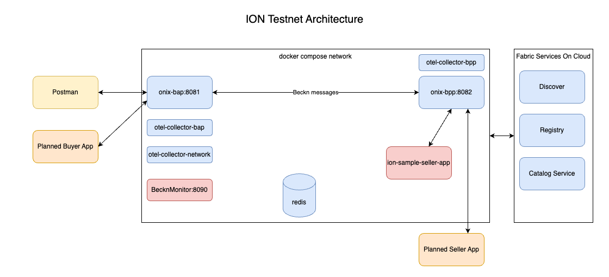

## ION Testnet

Inspired by the [Beckn local retail devkit and testnet](https://github.com/beckn/local-retail/tree/main/testnet/retail-devkit), the ion Testnet provides a docker compose based all in one development and testing platform for ION (Indonesia Open Network)

---

## Table of Contents

- [Overview](#overview)
- [Prerequisites](#prerequisites)
- [Repository Structure](#repository-structure)
- [Quick Start](#quick-start)
- [Importing Postman Collections](#importing-postman-collections)
- [Making API Requests](#making-api-requests)
- [Architecture](#architecture)
- [Troubleshooting](#troubleshooting)

---

## Overview

The ION Testnet enables developers to simulate and test decentralised commerce transactions in different sectors over the beckn protocol. It bundles together a docker compose based network containing the ONIX adapters, simulated seller apps, thin monitoring service for troubleshooting. In addition additional guides and postman collections are provided to help developers quickly build Buyer Apps and Seller Apps.

---

## Prerequisites

Before you begin, ensure the following tools are installed on your system:

- **Git** — to clone this repository
- **Docker** and **Docker Compose** — to run the adapter stack
  - [Install Docker](https://docs.docker.com/engine/install/)
  - Docker Compose is included with Docker Desktop; for Linux, follow the [Compose plugin guide](https://docs.docker.com/compose/install/)
- **Postman** — to import and run the test collections
  - [Download Postman](https://www.postman.com/downloads/)

---

## Repository Structure

```text
testnet/
├── config/          # Configuration files for the adapter
├── docker-compose-testnet.yml  # docker compose 
└── postman/         # Postman collections for testing
```

---

## Quick Start

Follow these steps to get the ION testnet running locally:

**1. Clone the repository**

```bash
git clone https://github.com/indonesiaopennetwork/ion-onix.git
cd ion-onix
```

**2. Start the adapter stack**

```bash
cd testnet
docker compose -f docker-compose-testnet.yml up --build
```

This command builds and starts all required services. The first run may take a few minutes to pull and build Docker images.

**3. Verify the stack is running**

Once the containers are up, verify the services are healthy:

```bash
docker compose -f docker-compose-adapter.yml ps
```

All services should show a `running` or `healthy` status.

---

## Importing Postman Collections

The `postman/` directory contains pre-built collections for testing the ION APIs in various sectors.

**Step 1 — Open Postman**

Launch the Postman desktop application.

**Step 2 — Import the collection**

1. Click **Import** in the top-left corner of the Postman window.
2. Select **File** in the import modal.
3. Navigate to the `postman/` directory in your cloned repository.
4. Select the relevant collection file (`.json`) and click **Open**.

---

## Making API Requests

Once the stack is running and the collection is imported:

1. Expand the collection in the Postman sidebar to view available requests.
2. Click on a request to open it.
3. Review the request method, URL, and body.
4. Click **Send** to execute the request.
5. The response will appear in the panel below.

The collections are ordered to reflect a typical beckn transaction flow (for example: `discover` → `on_discover` → `select` → `on_select`, and so on). Run them in sequence for an end-to-end test.

---

## Architecture

The devkit simulates a beckn-compliant Buyer App (BAP-Beckn Application Platform) and Seller App (BPP-Beckn Provider Platform) ONIX adapter pair locally. Here is a high-level overview of the data flow:



---

## Troubleshooting

**Containers fail to start**

Check for port conflicts. Inspect logs with:

```bash
docker compose -f docker-compose-testnet.yml logs
```

**Postman requests return connection errors**

Ensure the Docker stack is running and the `BASE_URL` collection variable points to the correct host and port.

**Images fail to build**

Make sure Docker has sufficient resources allocated (RAM/CPU) and that you have a stable internet connection for pulling base images.

**Stopping the stack**

```bash
docker compose -f docker-compose-testnet.yml down
```

---

## License

This project is part of the Indonesia Open Network ecosystem. Refer to the root repository for license details.

